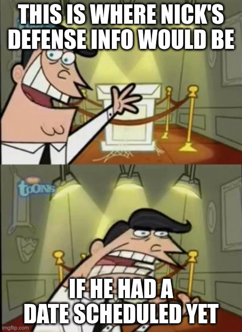

This post will have information about Nick's defense (when it is finally scheduled!)

---

You made it to the right place!  Just....One missing detail....

    

        
    

    WHEN HE SCHEDULES FINALLY

